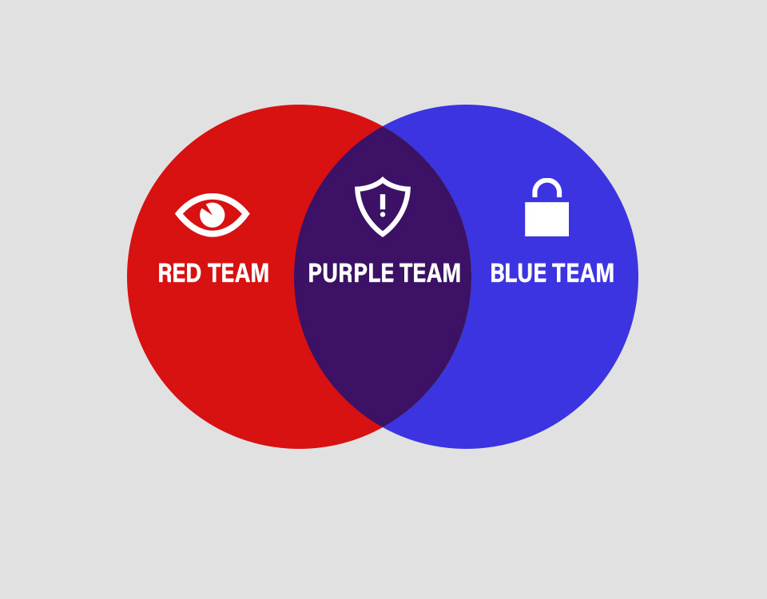

  

# 🛡️ Metasploitable 2 – Blue Team y Red Team

Bienvenido a este proyecto de seguridad, donde trabajamos con **Metasploitable 2**, una máquina vulnerable diseñada para practicar **técnicas de defensa (Blue Team)** y **ataque controlado (Red Team)** en un laboratorio seguro.

---

## 📖 Introducción

Metasploitable 2 contiene múltiples servicios vulnerables intencionadamente.  
El proyecto está dividido en dos secciones principales:

- **Blue Team**: Hardening y mitigación de vulnerabilidades.  
- **Red Team**: Pruebas de explotación controladas para demostrar el impacto de las vulnerabilidades en laboratorio.

---

## 🎯 Objetivos

1. Identificar y documentar vulnerabilidades en servicios comunes.  
2. Aplicar medidas de seguridad para mitigarlas.  
3. Practicar técnicas ofensivas en un entorno controlado.  
4. Comparar resultados antes y después de aplicar las medidas de seguridad.  
5. Generar documentación clara y reproducible para auditorías o prácticas educativas.

---

## 🛠️ Metodología

- Escaneo inicial de la máquina con `nmap` para detectar puertos abiertos y servicios.  
- Análisis de vulnerabilidades conocidas en cada servicio.  
- Aplicación de medidas Blue Team: firewalls, cierre de servicios, configuración segura.  
- Ejecución de ataques en laboratorio para Red Team usando Metasploit, nc, sqlmap, nikto y otras herramientas.  
- Documentación detallada de cada paso, incluyendo comandos, explicaciones, antes/después y resultados esperados.

---

## 📂 Índice del proyecto

### 🔵 Blue Team
1. [Firewalls](BLUE_TEAM/1-firewalls.md)  
2. [Mitigación de fuerza bruta](BLUE_TEAM/2-mitigacion-fuerza-bruta.md)  
3. [Servicios clásicos (Telnet, FTP, RSH/RLOGIN)](BLUE_TEAM/3-servicios-clasicos.md)  
4. [Servicios de correo y DNS (SMTP, DNS)](BLUE_TEAM/4-correo-dns.md)  
5. [Servicios web (Apache, Tomcat/AJP)](BLUE_TEAM/5-servicios-web.md)  
6. [Servicios de compartición y RPC (Samba, NFS/RPC)](BLUE_TEAM/6-comparticion-rpc.md)  
7. [Bases de datos (MySQL, PostgreSQL)](BLUE_TEAM/7-bbdd.md)  
8. [Servicios remotos y otros (DistCC, VNC/X11, Bindshell, IRC)](BLUE_TEAM/8-remotos-otros.md)  
9. [Herramientas adicionales y buenas prácticas](BLUE_TEAM/9-herramientas.md)  
10. [Aplicación y comprobación de cambios](BLUE_TEAM/10-aplicacion-comprobacion.md)  

### 🔴 Red Team
1. [SMTP](RED_TEAM/1-smtp.md)  
2. [HTTP (80)](RED_TEAM/2-http.md)  
3. [VNC (5900)](RED_TEAM/3-vnc.md)  
4. [Bind Shell (1524)](RED_TEAM/4-bindshell.md)  
5. [MySQL (3306)](RED_TEAM/5-mysql.md)  
6. [Reverse Shell](RED_TEAM/6-reverse-shell.md)  
7. [FTP (21)](RED_TEAM/7-ftp.md)  
8. [SSH (22)](RED_TEAM/8-ssh.md)  
9. [Telnet (23)](RED_TEAM/9-telnet.md)  
10. [Samba (139/445)](RED_TEAM/10-samba.md)  
11. [ProFTPD (2121)](RED_TEAM/11-proftpd.md)  
12. [Checklist y Reporting](RED_TEAM/12-checklist-report.md)  

---

## 🖥️ Ejemplo de comandos (Blue Team)
# Bloquear Telnet
# sudo iptables -A INPUT -p tcp --dport 23 -j DROP

# Configurar SSH solo con clave y deshabilitar root
# sudo sed -i 's/PermitRootLogin yes/PermitRootLogin no/' /etc/ssh/sshd_config
# sudo sed -i 's/#PasswordAuthentication yes/PasswordAuthentication no/' /etc/ssh/sshd_config
# sudo systemctl restart ssh

---

## 🖥️ Ejemplo de comandos (Red Team)
# Escaneo SMTP
# nmap -sV -p 25 --script=smtp-enum-users,smtp-commands 192.168.10.10 -oN RED_TEAM/outputs/red_smtp_nmap.txt

# Escaneo HTTP con Nikto
# nikto -host http://192.168.10.10 -output RED_TEAM/outputs/red_nikto.txt

---

## 📌 Buenas prácticas

- Siempre trabajar en **entornos aislados (Host-only / Internal network)**.  
- Hacer **snapshots** antes de realizar exploits.  
- Guardar resultados en `RED_TEAM/outputs/`.  
- Documentar todos los pasos, salidas y resultados.  
- Comparar resultados con medidas Blue Team.

---

## 🔗 Referencias

- [Metasploitable 2 Official](https://sourceforge.net/projects/metasploitable/)  
- [Nmap Scripts](https://nmap.org/nsedoc/)  
- [Metasploit Documentation](https://docs.rapid7.com/metasploit/)  
- [Nikto Web Scanner](https://cirt.net/Nikto2)

## Contacto

- [LinkedIn](https://www.linkedin.com/in/julio-lópez-cotán-1032aa348)
- Correo: juliolopezcotan6@gmail.com
- Portafolio: [Metasploitable Ataque-Defensa](https://julio161612.github.io/Metasploitable-ataque-defensa-/)
